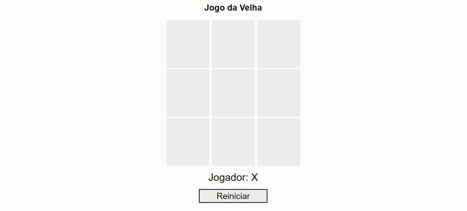

<h1 align="center"># Jogo Da Velha </h1>

<h2 align="center"><a href="https://aandersonsantos.github.io/Jogo-Da-Velha/"># Clique Aqui Para Jogar #</a></h2>

<h3 align="center">📸Screenshot</h3>
<p>
<h1 align="center"></h1>

## 📋**Sobre**

#Neste projeto, desenvolvemos um jogo da velha utilizando [Html](https://developer.mozilla.org/pt-BR/docs/Web/), [css](https://developer.mozilla.org/pt-BR/docs/Web/CSS) e [JavaScript](https://developer.mozilla.org/pt-BR/docs/Web/JavaScript). Projeto criado no bootcamp.

---

## 💾**Clone Do Repositório**

```
#Para fazer clone do repositório ultilizando git use a linha de comando abaixo:

git clone https://github.com/AAndersonSantos/Jogo-Da-Velha.git

```

---

## 📝**Licença**

[MIT](https://github.com/AAndersonSantos/Jogo-Da-Velha/blob/main/LICENSE)
